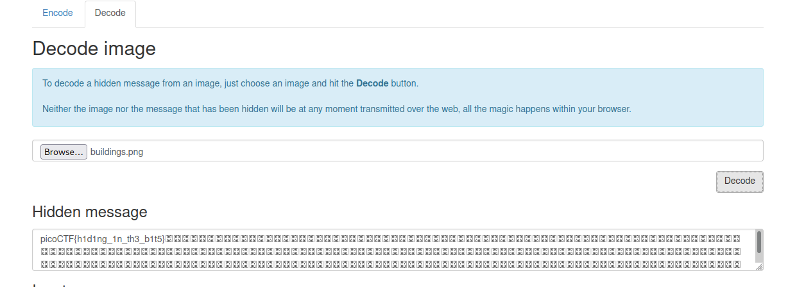

## Objetivo
There's something in the [building](https://jupiter.challenges.picoctf.org/static/011955b303f293d60c8116e6a4c5c84f/buildings.png). Can you retrieve the flag?

## Solución
1. Primero descargamos la imagen.
``` bash

┌──(kali㉿kali)-[~/retosPIcoCTF]
└─$ wget https://jupiter.challenges.picoctf.org/static/011955b303f293d60c8116e6a4c5c84f/buildings.png
--2022-10-09 17:54:00--  https://jupiter.challenges.picoctf.org/static/011955b303f293d60c8116e6a4c5c84f/buildings.png
Resolving jupiter.challenges.picoctf.org (jupiter.challenges.picoctf.org)... 3.131.60.8
Connecting to jupiter.challenges.picoctf.org (jupiter.challenges.picoctf.org)|3.131.60.8|:443... connected.
HTTP request sent, awaiting response... 200 OK
Length: 625219 (611K) [application/octet-stream]
Saving to: ‘buildings.png’

buildings.png                             100%[===================================================================================>] 610.57K   313KB/s    in 2.0s    

2022-10-09 17:54:06 (313 KB/s) - ‘buildings.png’ saved [625219/625219]

┌──(kali㉿kali)-[~/retosPIcoCTF]
└─$ ls
buildings.png

```

2. Si abrimos la imagen nos damos cuenta que contiene una imagen.
3. Utilizamos el sitio https://stylesuxx.github.io/steganography/  y utilizando la seccion de Decode para ver si la imagen contiene un mesaje secreto.


y como se observa la imagen contenia la badera.
la bandera es: picoCTF{h1d1ng_1n_th3_b1t5}

Decodificas la imagen y a ya. usando esteganografia en linea
## Notas
1. esteganografia e trata el estudio y aplicación de técnicas que permiten ocultar mensajes u objetos, dentro de otros, llamados _portadores_, para que no se perciba su existencia.