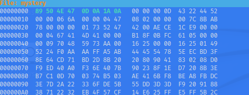

## Objetivo
We found this [file](https://jupiter.challenges.picoctf.org/static/ab30fcb7d47364b4190a7d3d40edb551/mystery). Recover the flag.

## Solución
1. Primero descargamos el archivo.
``` bash
┌──(kali㉿kali)-[~/pico]
└─$ ls
                                                                                                                                                                       
┌──(kali㉿kali)-[~/pico]
└─$ wget https://jupiter.challenges.picoctf.org/static/ab30fcb7d47364b4190a7d3d40edb551/mystery
--2022-10-17 21:49:25--  https://jupiter.challenges.picoctf.org/static/ab30fcb7d47364b4190a7d3d40edb551/mystery
Resolving jupiter.challenges.picoctf.org (jupiter.challenges.picoctf.org)... 3.131.60.8
Connecting to jupiter.challenges.picoctf.org (jupiter.challenges.picoctf.org)|3.131.60.8|:443... connected.
HTTP request sent, awaiting response... 200 OK
Length: 202940 (198K) [application/octet-stream]
Saving to: ‘mystery’

mystery                                   100%[====================================================================================>] 198.18K   352KB/s    in 0.6s    

2022-10-17 21:49:27 (352 KB/s) - ‘mystery’ saved [202940/202940]

                                                                                                                                                                       
┌──(kali㉿kali)-[~/pico]
└─$ ls
mystery
```
Si hacemos un vaciado hexadecimal al archivo nos damos cuenta que se trara de una rchivo png, pero contiene los magic byts dañados.
``` bash
─$ xxd mystery | head
00000000: 8965 4e34 0d0a b0aa 0000 000d 4322 4452  .eN4........C"DR
00000010: 0000 066a 0000 0447 0802 0000 007c 8bab  ...j...G.....|..
00000020: 7800 0000 0173 5247 4200 aece 1ce9 0000  x....sRGB.......
00000030: 0004 6741 4d41 0000 b18f 0bfc 6105 0000  ..gAMA......a...
00000040: 0009 7048 5973 aa00 1625 0000 1625 0149  ..pHYs...%...%.I
00000050: 5224 f0aa aaff a5ab 4445 5478 5eec bd3f  R$......DETx^..?
00000060: 8e64 cd71 bd2d 8b20 2080 9041 8302 08d0  .d.q.-.  ..A....
00000070: f9ed 40a0 f36e 407b 9023 8f1e d720 8b3e  ..@..n@{.#... .>
00000080: b7c1 0d70 0374 b503 ae41 6bf8 bea8 fbdc  ...p.t...Ak.....
00000090: 3e7d 2a22 336f de5b 55dd 3d3d f920 9188  >}*"3o.[U.==. ..
```

2. Corregimos el encabezado de la imagen. Esto lo hacemos utilizando la herramienta `hexeditor` y editamos los bit de la cabecera de la siguiente forma.

 El texto en verde son los bytes cambiados.


3. A pesar de todo lo anterior la imagen sigue sin ser recnozida, por lo que modificamos los chunks de la imagen.

Después de este cambio, la imagen ahora esta en formato PNG, pero la imagen sigue teniendo errores, por lo que usamos la  herramienta  `pngcheck` para reparar la imagen. Instalamos `pngchek` con el comando `sudo apt`

4. Examinamos la imgane con la herraimienta y esta nos dira que roblema tiene.
``` bash
┌──(kali㉿kali)-[~/pico]
└─$ pngcheck -v mystery
File: mystery (202940 bytes)
  chunk IHDR at offset 0x0000c, length 13
    1642 x 1095 image, 24-bit RGB, non-interlaced
  chunk sRGB at offset 0x00025, length 1
    rendering intent = perceptual
  chunk gAMA at offset 0x00032, length 4: 0.45455
  chunk pHYs at offset 0x00042, length 9: 2852132389x5669 pixels/meter
  CRC error in chunk pHYs (computed 38d82c82, expected 495224f0)
ERRORS DETECTED in mystery

```
Al parecer las dimenciones de la imgane son muy grandes por lo qeu editamos la imagen de nuevo usando ``hexeditor`


5. Volvemos a revisar la imagen con el pngcheck
``` bash
┌──(kali㉿kali)-[~/pico]
└─$ pngcheck -v mystery
File: mystery (202940 bytes)
  chunk IHDR at offset 0x0000c, length 13
    1642 x 1095 image, 24-bit RGB, non-interlaced
  chunk sRGB at offset 0x00025, length 1
    rendering intent = perceptual
  chunk gAMA at offset 0x00032, length 4: 0.45455
  chunk pHYs at offset 0x00042, length 9: 5669x5669 pixels/meter (144 dpi)
:  invalid chunk length (too large)
ERRORS DETECTED in mystery

```
y sigue habiendo errores en lo chunks. Esta vez en el chunk IDAT que esta mal escrito.

6. Modificamos los siguientes chunks.


7. Si volvemos a hacer examinar la imagen con el pngcheck nos dira que la imagen esta vez esta correcta y al abrir la imagen esto nos dara la bandera.


## Notas
