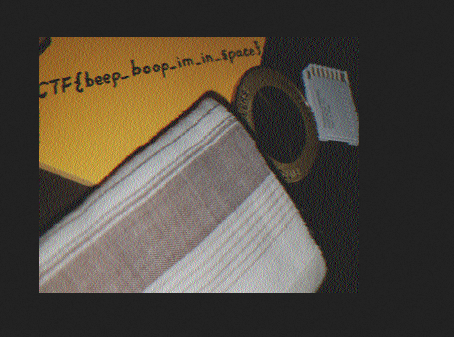

## Objetivo
Decode this [message](https://jupiter.challenges.picoctf.org/static/d6fcea5e3c6433680ea4f914e24fab61/message.wav) from the moon.

## Solución
1. Primero descarga el archivo de audio.
``` bash
┌──(kali㉿kali)-[~/retosPIcoCTF]
└─$ wget https://jupiter.challenges.picoctf.org/static/d6fcea5e3c6433680ea4f914e24fab61/message.wav  
--2022-10-09 18:05:52--  https://jupiter.challenges.picoctf.org/static/d6fcea5e3c6433680ea4f914e24fab61/message.wav
Resolving jupiter.challenges.picoctf.org (jupiter.challenges.picoctf.org)... 3.131.60.8
Connecting to jupiter.challenges.picoctf.org (jupiter.challenges.picoctf.org)|3.131.60.8|:443... connected.
HTTP request sent, awaiting response... 200 OK
Length: 11066998 (11M) [application/octet-stream]
Saving to: ‘message.wav’

message.wav                               100%[===================================================================================>]  10.55M   425KB/s    in 31s     

2022-10-09 18:06:25 (348 KB/s) - ‘message.wav’ saved [11066998/11066998]

┌──(kali㉿kali)-[~/retosPIcoCTF]
└─$ ls
message.wav
```

2. Descargamos el siguiente decodificador SSTV https://github.com/colaclanth/sstv. Instalamos la herramienta corriendo los siguientes comandos.
``` bash
$ git clone https://github.com/colaclanth/sstv.git

$ python setup.py install

```

3. Decodificamos el archivo `message.wav` utilizanod el siguiente comando.
``` bash
└─$ sstv -d message.wav -o result.png 
[sstv] Searching for calibration header... Found!    
[sstv] Detected SSTV mode Scottie 1
[sstv] Decoding image...                                   [####################################################################################################] 100%
[sstv] Drawing image data...
[sstv] ...Done!

```

4. Por último, abrimos la imagen resultante la cual contiene la bandera pero rotada 180 grados por lo que solo la rotamos para que quede bien centrada y obtengamos la bandera.


## Notas