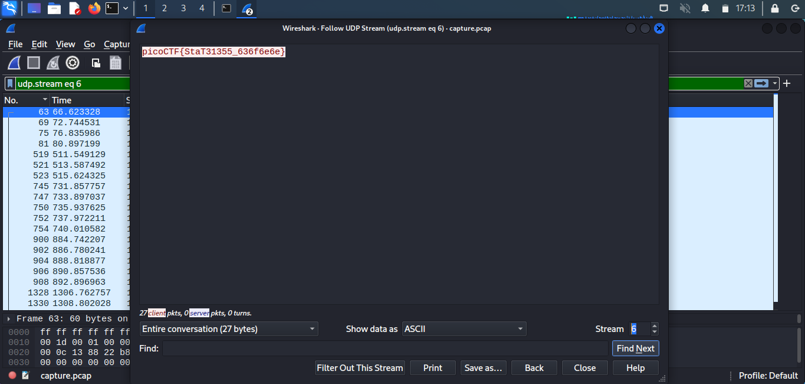

## Objetivo
We found this [packet capture](https://jupiter.challenges.picoctf.org/static/483e50268fe7e015c49caf51a69063d0/capture.pcap). Recover the flag.

## Solución
1. Primero descargamos el archivo.
``` bash
$ wget https://jupiter.challenges.picoctf.org/static/483e50268fe7e015c49caf51a69063d0/capture.pcap
--2022-10-09 16:49:25--  https://jupiter.challenges.picoctf.org/static/483e50268fe7e015c49caf51a69063d0/capture.pcap
Resolving jupiter.challenges.picoctf.org (jupiter.challenges.picoctf.org)... 3.131.60.8
Connecting to jupiter.challenges.picoctf.org (jupiter.challenges.picoctf.org)|3.131.60.8|:443... connected.
HTTP request sent, awaiting response... 200 OK
Length: 239455 (234K) [application/octet-stream]
Saving to: ‘capture.pcap’

capture.pcap                              100%[===================================================================================>] 233.84K  9.07KB/s    in 39s     

2022-10-09 16:50:07 (6.06 KB/s) - ‘capture.pcap’ saved [239455/239455]

```

2. Abrimos la aplicación de wireshark que es una aplicación que sirve para analizar paquetes.
3. Abrimos el archivo capture.pcap.
4. selecciona 1 paquete UDP dentro de wireshark y sigue su stream de paquetes (da click derecho luego ve a la opción de follow y por último da click en la opción UDP Stream)
5. Luego ve al paquete número 6 y encuentras la bandera.  

## Notas
La captura de paquetes o PCAP (también conocida como libpcap) es una interfaz de programación de aplicaciones (API) que captura datos de paquetes de red en vivo de las capas 2-7 del modelo OSI.
