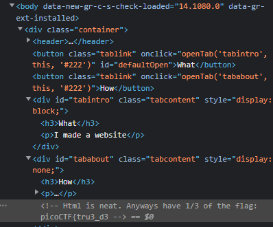
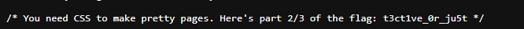

## Objetivo
Kishor Balan tipped us off that the following code may need inspection: `https://jupiter.challenges.picoctf.org/problem/41511/` ([link](https://jupiter.challenges.picoctf.org/problem/41511/)) or http://jupiter.challenges.picoctf.org:41511

## Solución
Revisamos el sitio web de la liga e insepccionamos el código. Al hacer esto nos topamos con el siguinte comentario.

Ahora, si inseoeccionamos el css de el sitio nos encontramos con las siguinete parte de la bandera.

y por último, si insepeccionamos el código java script del sitio nos encontramos con la ultima parte de la bandera.

## Notas
1. para inspeccionar un sitio web damos click derecho e inspeccionar.
