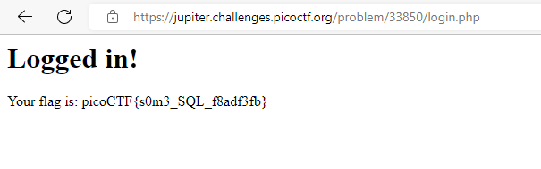

## Objetivo

There is a website running at `https://jupiter.challenges.picoctf.org/problem/33850/` ([link](https://jupiter.challenges.picoctf.org/problem/33850/)) or http://jupiter.challenges.picoctf.org:33850. Do you think you can log us in? Try to see if you can login!

## Solución
1. Entrar en el sitio web [W3.CSS Template (picoctf.org)](https://jupiter.challenges.picoctf.org/problem/33850/) y entrar al apartado de admin login
2. Luego hacemos una inyección SQL. Como usuario escribimos admin y como password escribimos ' or 1 == 1;

## Notas
La inyección SQL es una vulnerabilidad de seguridad web que permite que un atacante interfiera con las consultas que una aplicación realiza en su base de datos. En general, permite a un atacante ver datos que normalmente no pueden recuperar
