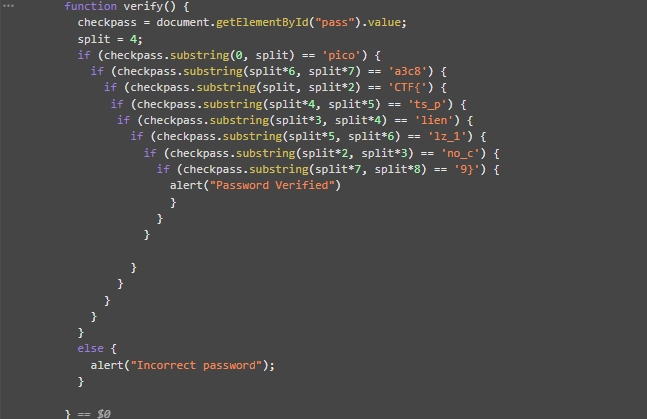

## Objetivo
Can you break into this super secure portal? `https://jupiter.challenges.picoctf.org/problem/37821/` ([link](https://jupiter.challenges.picoctf.org/problem/37821/)) or http://jupiter.challenges.picoctf.org:37821

## Solución
1. Entramos a la sito web.
2. inspeccionamos el código HTML  y nos damos cuneta que el login está validando la contraseña del lado del cliente o del front-end.

3. La función está validadndo la contraseña en partes de 4 caracteres, por lo que simplemente pasamos a construir la bandera a partir del código de arriba.

Flag: `picoCTF{no_clients_plz_1a3c89}`

## Notas
