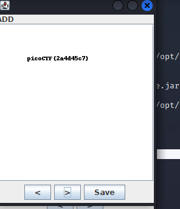

## Objetivo
I have these 2 images, can you make a flag out of them? [scrambled1.png](https://mercury.picoctf.net/static/49743139fb7c10765dbf462d40987d2a/scrambled1.png) [scrambled2.png](https://mercury.picoctf.net/static/49743139fb7c10765dbf462d40987d2a/scrambled2.png)

## Solución
1. Descargamos las 2 imagenes.
2. Instalamos la herramienta de stenografía stegosolve
``` shell
┌──(kali㉿kali)-[~/pico]
└─$ wget http://www.caesum.com/handbook/Stegsolve.jar -O stegsolve.jar
--2022-11-01 23:10:59--  http://www.caesum.com/handbook/Stegsolve.jar
Resolving www.caesum.com (www.caesum.com)... 216.234.173.1
Connecting to www.caesum.com (www.caesum.com)|216.234.173.1|:80... connected.
HTTP request sent, awaiting response... 200 OK
Length: 312271 (305K) [application/x-java-archive]
Saving to: ‘stegsolve.jar’

stegsolve.jar                             100%[====================================================================================>] 304.95K  55.1KB/s    in 5.5s    

2022-11-01 23:11:06 (55.1 KB/s) - ‘stegsolve.jar’ saved [312271/312271]

┌──(kali㉿kali)-[~/pico]
└─$ chmod +x stegsolve.jar
```

2. Abrimos la herramienta con el siguiente comando.
``` bash
┌──(kali㉿kali)-[~/pico]
└─$ sudo java -jar stegsolve.jar
```
Esto nos debio abrir una ventana de una aplicación.

3. Abrimos la primera imagen, leugo vamos al apartado de Analyse, luego a Image Combiner y seleccionamos la segunda imagen. Una vez hecho esto aplicamos el ADD en la aplicación y esto nos dara la bandera.


FLAG: picoCTF{2a4d45c7}
## Notas