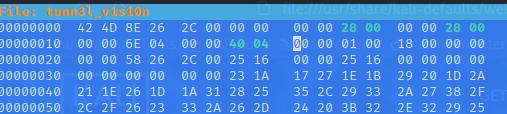
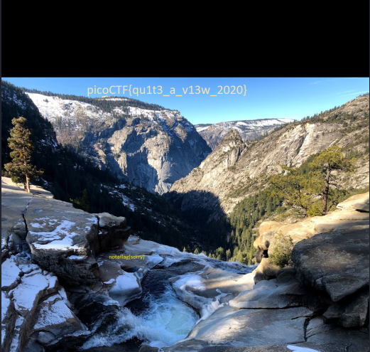

## Objetivo
We found this [file](https://mercury.picoctf.net/static/01be2b38ba97802285a451b94505ea75/tunn3l_v1s10n). Recover the flag.

## Solución
1. Descargar del archivo.
``` bash
┌──(kali㉿kali)-[~/pico]
└─$ wget https://mercury.picoctf.net/static/01be2b38ba97802285a451b94505ea75/tunn3l_v1s10n
--2022-10-25 09:21:45--  https://mercury.picoctf.net/static/01be2b38ba97802285a451b94505ea75/tunn3l_v1s10n
Resolving mercury.picoctf.net (mercury.picoctf.net)... 18.189.209.142
Connecting to mercury.picoctf.net (mercury.picoctf.net)|18.189.209.142|:443... connected.
HTTP request sent, awaiting response... 200 OK
Length: 2893454 (2.8M) [application/octet-stream]
Saving to: ‘tunn3l_v1s10n’

tunn3l_v1s10n                             100%[===================================================================================>]   2.76M  1.30MB/s    in 2.1s    

2022-10-25 09:21:48 (1.30 MB/s) - ‘tunn3l_v1s10n’ saved [2893454/2893454]

```

2. Podemos ver que el encabezado y el tamaño son incorrectos, por lo cual, cambiamos le extención de la imagen a .bmp y el tamaño de la imagen usando un editor hexadecimal. En la imagen de abajo se observan los cambios hechos la imagen usando el editor hexadecimal `edithex`


3. Abrimos la imagen resultante y encontramos la bandera.

Bandera : picoCTF{qu1t3_a_v13w_2020}

## Notas
