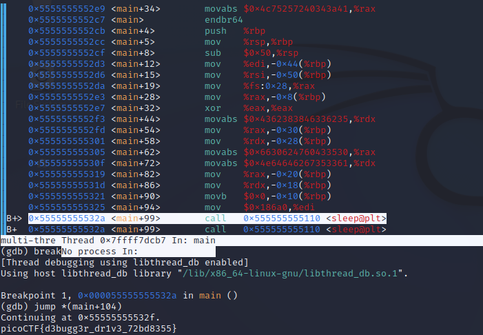

## Objetivo
Can you get the flag?Download this [binary](https://artifacts.picoctf.net/c/116/gdbme).Here's the test drive instructions:

-   `$ chmod +x gdbme`
-   `$ gdb gdbme`
-   `(gdb) layout asm`
-   `(gdb) break *(main+99)`
-   `(gdb) run`
-   `(gdb) jump *(main+104)`


## Solución
1. Descargamos el binario.
2. Damos perisos de ejecución al archivo.
``` shell
┌──(kali㉿kali)-[~/pico]
└─$ chmod +x gdbme 
```
3. Ejecutamos las instruciones dadas en el objetivio del problema y obtenemos la bandera.


La bandera es: picoCTF{d3bugg3r_dr1v3_72bd8355}

## Notas