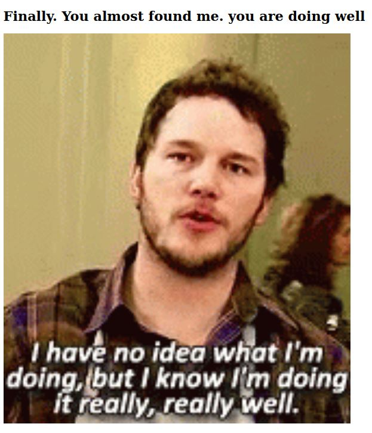
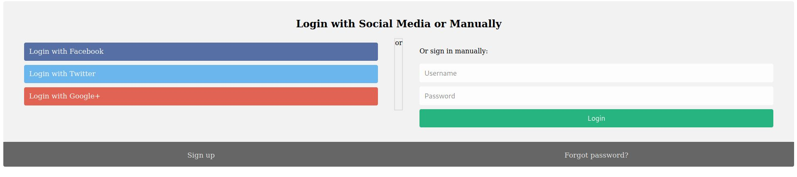
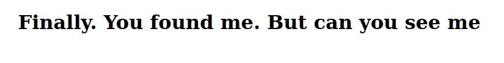

## Objetivo
We have several pages hidden. Can you find the one with the flag?The website is running [here](http://saturn.picoctf.net:50167/).

## Solución
1. Al inspeccionar el código fuente del sitio nos damos cuenta que existe una carpeta llamada secret
``` html
    <meta
      name="viewport"
      content="width=device-width, initial-scale=1, shrink-to-fit=no"
    />
    <meta name="description" content="" />
    <!-- Bootstrap core CSS -->
    <link href="vendor/bootstrap/css/bootstrap.min.css" rel="stylesheet" />
    <!-- title -->
    <title>home</title>
    <!-- css -->
    <link href="secret/assets/index.css" rel="stylesheet" />
  </head>
```
Entramos a la carpeta /secret ingresando a la siguiente URL [saturn.picoctf.net:50167/secret/](http://saturn.picoctf.net:50167/secret/)

2. Al entrar a la  URL anterior nos aparecerá la siguiente página. 


3. Volvemos a inspeccionar el código fuente del sitio.
``` html
<!DOCTYPE html>
<html>
  <head>
    <title></title>
    <link rel="stylesheet" href="hidden/file.css" />
  </head>

  <body>
    <h1>Finally. You almost found me. you are doing well</h1>
    
  </body>
</html>
```
 y encontramos otra carpeta llamada /hidden por lo que accedemos a ella mediante la siguiente URL: [saturn.picoctf.net:50167/secret/hidden/](http://saturn.picoctf.net:50167/secret/hidden/)
3. Al entrar a la URL anterior nos aparecera la siguiente página.

 inspeccionaremos el código fuenta de la página de nuevo .
``` html
 <head>
    <title>LOGIN</title>
    <!-- css -->
    <link href="superhidden/login.css" rel="stylesheet" />
  </head>
```
Encontramos otra carpeta llamada superhidden por lo que accedemos a la nueva carpeta mediante la URL: [saturn.picoctf.net:50167/secret/hidden/superhidden/](http://saturn.picoctf.net:50167/secret/hidden/superhidden/)

4. Al entrar a la carpeta superhidden nos aparece la siguiente pagina

Pero si inspecionamos el código fuente de la página obtenermos la bandera.
``` html
<!DOCTYPE html>
<html>
  <head>
    <title></title>
    <link rel="stylesheet" href="mycss.css" />
  </head>

  <body>
    <h1>Finally. You found me. But can you see me</h1>
    <h3 class="flag">picoCTF{succ3ss_@h3n1c@10n_51b260fe}</h3>
  </body>
</html>
```

## Notas